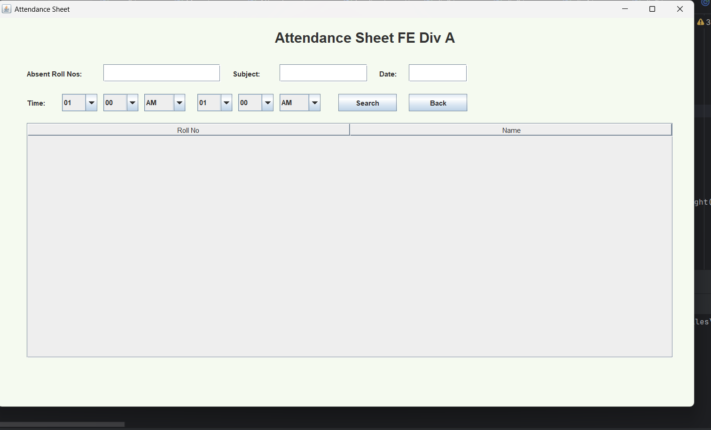
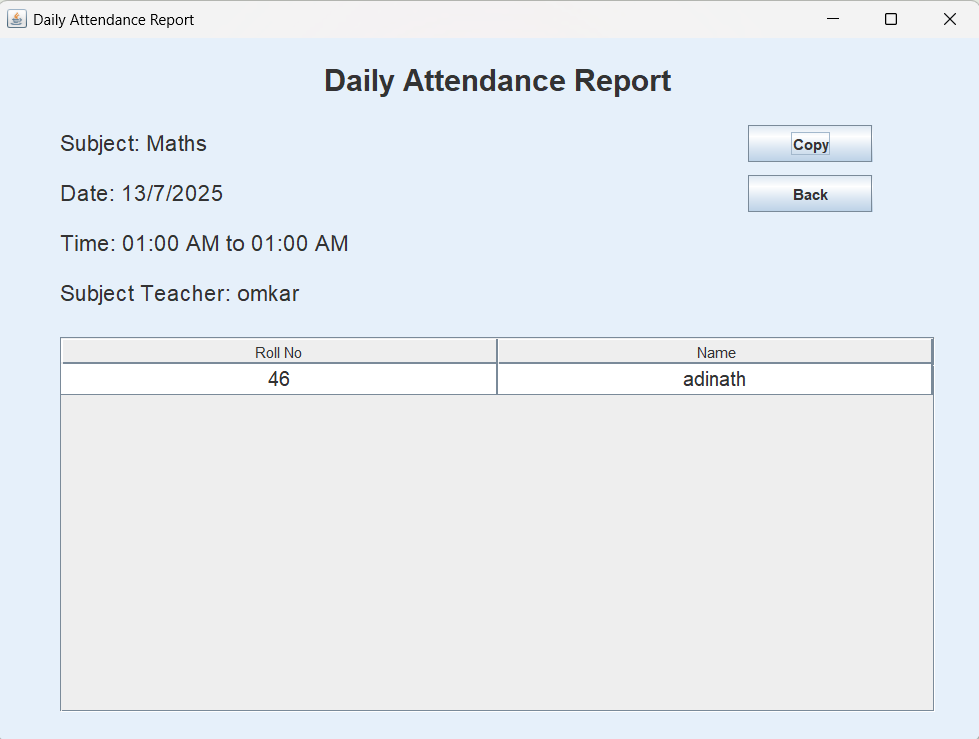
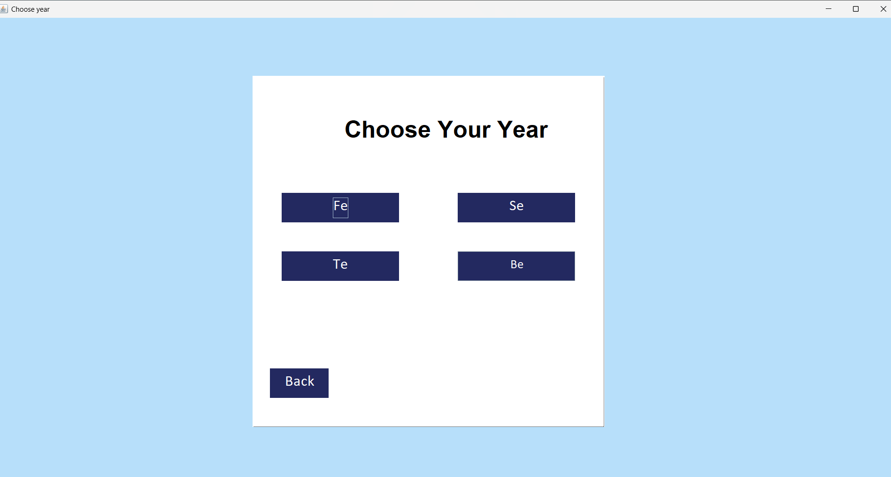

# 📝 Attendance Management System - Java GUI (Swing + MySQL)

A desktop-based **Attendance Management System** built using **Java Swing** for the GUI and **MySQL** for the backend database. This application allows teachers to manage attendance records, search for absent students by roll number, and copy reports for easy sharing. The project includes a basic login/signup system for teachers and supports class-wise student data management.

---

## ✅ Features Implemented

-   **🔍 Search by Roll Number**
    Enter a roll number to find and display the absent student's name and roll number.
    

-   **🧾 Display Absentees**
    Results are shown on a new GUI page with formatted output.
    

-   **📋 Copy Report Button**
    Click to copy the report (name + roll number) to the clipboard for easy sharing.

-   **🔙 Back Navigation**
    Navigate between the result screen and the home screen easily.

-   **🎨 Fixed Layout & Design**
    All components are styled using `setBounds()` with custom backgrounds and colors.

-   **🖼️ Custom Logo & Background Support**
    The project supports personalized branding via logo and background images.

---

## 🖼️ UI Screenshots

| Page                | Description                                        | Screenshot                                        |
| ------------------- | -------------------------------------------------- | ------------------------------------------------- |
| **Landing Page** | Welcome interface before admin/user login selection. |              |
| **Year Selection** | Select academic year (FE, SE, TE, BE).             |      |
| **Admin Page** | Login page specifically for administrators.        |             |
| **Home Page** | Options to view information or take attendance.    |               |
| **Information Page**| Displays class-wise student data from the database.|      |
| **Login Page** | Enter credentials to sign in.                      |          |
| **Name Page** | Input a student's roll number to check attendance. |               |
| **Report Page** | Displays absent student(s) with a copy button.     |             |
| **Update Page** | Feature to update student data (if implemented).   |                |

---

## 🛠️ Technologies Used

-   **Java**: Core language, utilizing the Swing framework for the GUI.
-   **MySQL**: For the backend database, connected via JDBC.
-   **JDK 8+**: Required Java Development Kit version.
-   **IDE**: Developed and tested on NetBeans and IntelliJ IDEA.

---

## 📂 How to Run

1.  **Clone the Repository**
    ```bash
    git clone [https://github.com/OmkarM9090/attendance-management-java.git](https://github.com/OmkarM9090/attendance-management-java.git)
    ```

2.  **Set Up the MySQL Database**
    -   Create a new database in MySQL (e.g., `attendance_db`).
    -   Create the required tables using the schemas provided below.
    -   (Optional) Import a `.sql` file if you have one:
        ```bash
        mysql -u your_username -p attendance_db < database/attendance_db.sql
        ```

3.  **Configure Database Credentials**
    -   Open the `DatabaseConnection.java` file in the project.
    -   Update the database URL, your MySQL username, and password.

4.  **Run the Application**
    -   Open the project in your preferred IDE (NetBeans or IntelliJ).
    -   Locate and run the `Main.java` file to start the application.

---

## 🗃️ Database Schema

### 📌 Table: `bea` – Student Data (BE A Division)

The `bea` table stores student data for a specific class, for example, Final Year - A Division (BE-A). Each student is uniquely identified by their phone number. Similar tables (`fea`, `sea`, `tea`) can be created for other years.

#### 💡 SQL Schema
```sql
CREATE TABLE bea (
    name VARCHAR(50),
    roll INT,
    email VARCHAR(50),
    phone BIGINT PRIMARY KEY,
    gender CHAR(50),
    class CHAR(50)
);

Of course. Here is your content formatted into a professional README.md file. I've used proper Markdown to structure the sections, create tables, and format the code blocks, while ensuring all your image links remain exactly as you provided them.

Markdown

# 📝 Attendance Management System - Java GUI (Swing + MySQL)

A desktop-based **Attendance Management System** built using **Java Swing** for the GUI and **MySQL** for the backend database. This application allows teachers to manage attendance records, search for absent students by roll number, and copy reports for easy sharing. The project includes a basic login/signup system for teachers and supports class-wise student data management.

---

## ✅ Features Implemented

-   **🔍 Search by Roll Number**
    Enter a roll number to find and display the absent student's name and roll number.
    

-   **🧾 Display Absentees**
    Results are shown on a new GUI page with formatted output.
    

-   **📋 Copy Report Button**
    Click to copy the report (name + roll number) to the clipboard for easy sharing.

-   **🔙 Back Navigation**
    Navigate between the result screen and the home screen easily.

-   **🎨 Fixed Layout & Design**
    All components are styled using `setBounds()` with custom backgrounds and colors.

-   **🖼️ Custom Logo & Background Support**
    The project supports personalized branding via logo and background images.

---

## 🖼️ UI Screenshots

| Page                | Description                                        | Screenshot                                        |
| ------------------- | -------------------------------------------------- | ------------------------------------------------- |
| **Landing Page** | Welcome interface before admin/user login selection. |              |
| **Year Selection** | Select academic year (FE, SE, TE, BE).             |      |
| **Admin Page** | Login page specifically for administrators.        |             |
| **Home Page** | Options to view information or take attendance.    |               |
| **Information Page**| Displays class-wise student data from the database.|      |
| **Login Page** | Enter credentials to sign in.                      |          |
| **Name Page** | Input a student's roll number to check attendance. |               |
| **Report Page** | Displays absent student(s) with a copy button.     |             |
| **Update Page** | Feature to update student data (if implemented).   |                |

---

## 🛠️ Technologies Used

-   **Java**: Core language, utilizing the Swing framework for the GUI.
-   **MySQL**: For the backend database, connected via JDBC.
-   **JDK 8+**: Required Java Development Kit version.
-   **IDE**: Developed and tested on NetBeans and IntelliJ IDEA.

---

## 📂 How to Run

1.  **Clone the Repository**
    ```bash
    git clone [https://github.com/OmkarM9090/attendance-management-java.git](https://github.com/OmkarM9090/attendance-management-java.git)
    ```

2.  **Set Up the MySQL Database**
    -   Create a new database in MySQL (e.g., `attendance_db`).
    -   Create the required tables using the schemas provided below.
    -   (Optional) Import a `.sql` file if you have one:
        ```bash
        mysql -u your_username -p attendance_db < database/attendance_db.sql
        ```

3.  **Configure Database Credentials**
    -   Open the `DatabaseConnection.java` file in the project.
    -   Update the database URL, your MySQL username, and password.

4.  **Run the Application**
    -   Open the project in your preferred IDE (NetBeans or IntelliJ).
    -   Locate and run the `Main.java` file to start the application.

---

## 🗃️ Database Schema

### 📌 Table: `bea` – Student Data (BE A Division)

The `bea` table stores student data for a specific class, for example, Final Year - A Division (BE-A). Each student is uniquely identified by their phone number. Similar tables (`fea`, `sea`, `tea`) can be created for other years.

#### 💡 SQL Schema
```sql
CREATE TABLE bea (
    name VARCHAR(50),
    roll INT,
    email VARCHAR(50),
    phone BIGINT PRIMARY KEY,
    gender CHAR(50),
    class CHAR(50)
);
🧾 Column Description
Column Name	Data Type	Description
name	VARCHAR(50)	Full name of the student
roll	INT	Roll number of the student
email	VARCHAR(50)	Email address
phone	BIGINT	Phone number (Primary Key)
gender	CHAR(50)	Gender
class	CHAR(50)	Class/Division (e.g., BE-A)

Export to Sheets
<br/>

📌 Table: teacher – Login/Signup System
This table manages the login credentials for teachers who will use the application.

💡 SQL Schema
CREATE TABLE teacher (
    username VARCHAR(50),
    password VARCHAR(50),
    phoneno BIGINT PRIMARY KEY,
    emailid VARCHAR(50),
    gender CHAR(50)
);

🧾 Column Description
Column Name	Data Type	Description
username	VARCHAR(50)	Teacher's username
password	VARCHAR(50)	Account password
phoneno	BIGINT	Phone number (Primary Key)
emailid	VARCHAR(50)	Email address
gender	CHAR(50)	Gender

Export to Sheets
🔜 Upcoming Features (Planned)
📤 Export to Excel/PDF: Functionality to export attendance reports.

📲 WhatsApp Sharing: A button to quickly share reports via WhatsApp.

📊 Analytics Dashboard: A dashboard with class-wise attendance analytics.

🧠 AI-based Insights: Analyze absenteeism patterns to identify trends.

👨‍💻 Author
Omkar Mahadik 🎓 Computer Engineering Student

🔗 LinkedIn

📜 License
This project is licensed under the MIT License. Feel free to use, modify, and distribute with appropriate credit.
