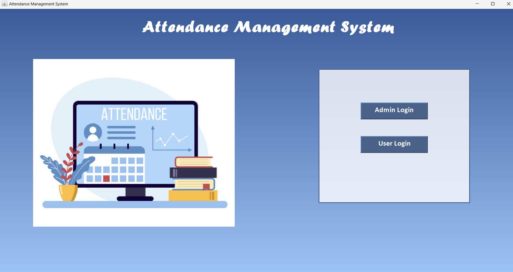
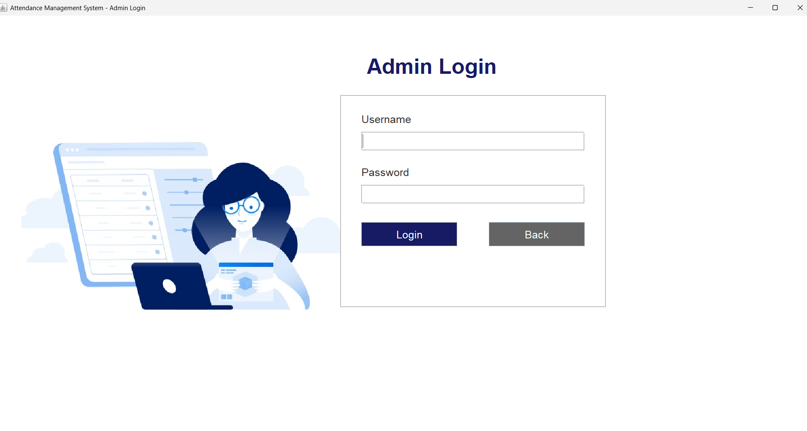
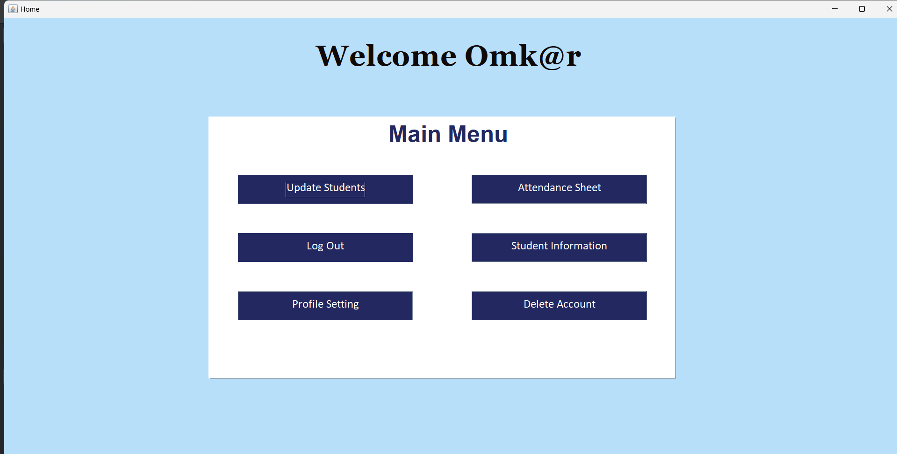
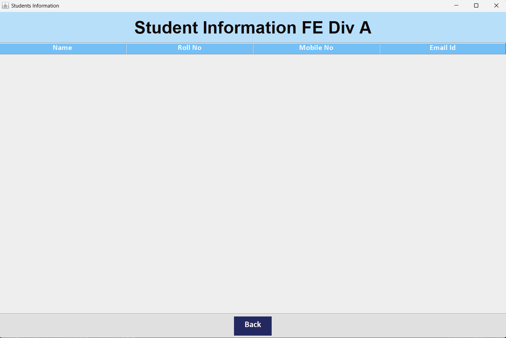
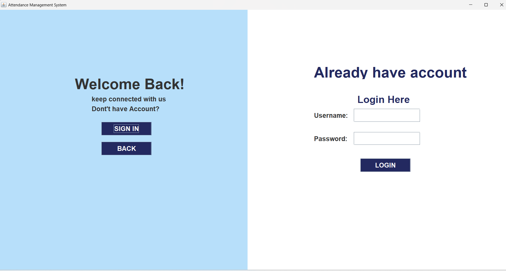
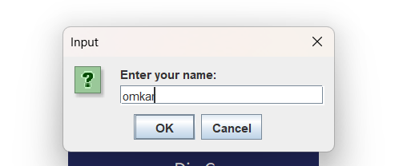
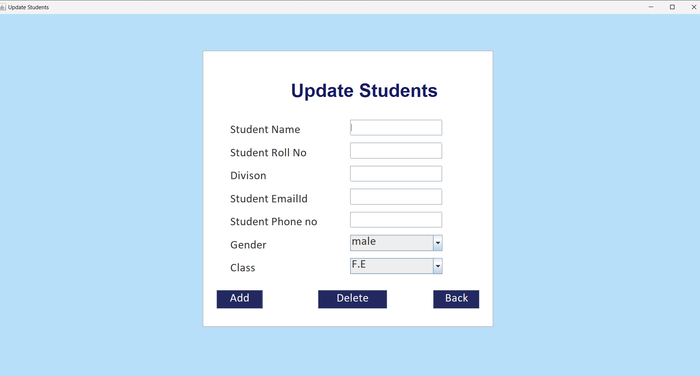

# 📝 Attendance Management System - Java GUI (Swing + MySQL)

A desktop-based **Attendance Management System** built using **Java Swing** for GUI and **MySQL** as the backend. The application allows teachers to manage attendance records, search for absent students by roll number, and copy reports. The project includes a basic login/signup system for teachers and supports class-wise student data management.

---

## ✅ Features Implemented

- 🔍 **Search by Roll Number**  
  Enter a roll number to find and display the absent student's name and roll number.  
  

- 🧾 **Display Absentees**  
  Results are shown on a new GUI page with formatted output.  
  


- 📋 **Copy Report Button**  
  Click to copy the report (name + roll number) to clipboard for easy sharing.

- 🔙 **Back Navigation**  
  Navigate between the result screen and home screen easily.

- 🎨 **Fixed Layout & Design**  
  All components are styled using `setBounds()` with custom background and color.

- 🖼️ **Custom Logo & Background Support**  
  Project supports personalized branding via logo and background images.

---

## 🖼️ UI Screenshots

| Page | Description | Screenshot |
|------|-------------|------------|
| Landing Page | Welcome interface before admin/user login selection |  |
| Year Selection Page | Select year (FE, SE, TE, BE) |  |
| Admin Page | adminr login-in page |  |
| Home Page | Options to view information or take attendance |  |
| Information Page | Displays class-wise student data |  |
| Login Page | Enter credentials to sign in |  |
| Name Page | Input student roll number to check attendance |  |
| Report Page | Display of absent student(s) with copy button |  |
| Update Page | Feature to update student data (if implemented) |  |

---

## 🛠️ Technologies Used

- **Java** – Swing for GUI
- **MySQL** – JDBC connection for database
- **JDK 8+**
- **NetBeans / IntelliJ IDEA** – Preferred IDEs

---

## 📂 How to Run

1. **Clone the Repository**
   ```bash
   git clone https://github.com/OmkarM9090/attendance-management-java.git

   ---
Set Up the MySQL Database

Create a new database (e.g., attendance_db)

Create the required tables using the schemas below

(Optional) Import the .sql file if provided:
mysql -u your_username -p attendance_db < database/attendance_db.sql
Configure Database Credentials

Open DatabaseConnection.java

Update your MySQL username, password, and DB name

Run the Application

Open the project in your IDE

Run Main.java
---

🗃️ Database Schema
### 📌 Table: `bea` – Student Data (BE A Division)

#### 💡 SQL Schema

```sql
CREATE TABLE bea (
    name VARCHAR(50),
    roll INT,
    email VARCHAR(50),
    phone BIGINT PRIMARY KEY,
    gender CHAR(50),
    class CHAR(50)
);
🧾 Column Description
Column Name	Data Type	Description
name	VARCHAR(50)	Full name of the student
roll	INT	Roll number of the student
email	VARCHAR(50)	Email address
phone	BIGINT	Phone number (Primary Key)
gender	CHAR(50)	Gender
class	CHAR(50)	Class/Division (e.g., BE-A, FE-A)


---

Use the same structure for the `teacher` table. Here’s the **correct version for that too**:


### 📌 Table: `teacher` – Login/Signup System

#### 💡 SQL Schema

```sql
CREATE TABLE teacher (
    username VARCHAR(50),
    password VARCHAR(50),
    phoneno BIGINT PRIMARY KEY,
    emailid VARCHAR(50),
    gender CHAR(50)
);
🧾 Column Description
Column Name	Data Type	Description
username	VARCHAR(50)	Teacher's username
password	VARCHAR(50)	Account password
phoneno	BIGINT	Phone number (Primary Key)
emailid	VARCHAR(50)	Email address
gender	CHAR(50)	Gender

---

🔜 Upcoming Features (Planned)
📤 Export attendance report to Excel and PDF

📲 WhatsApp sharing for quick communication

📊 Dashboard with class-wise attendance analytics

🧠 AI-based trend insights for absenteeism patterns

---

👨‍💻 Author
Omkar Mahadik
🎓 Computer Engineering Student
🔗 LinkedIn 

📜 License
This project is licensed under the MIT License.
Feel free to use, modify, and distribute with credit.
